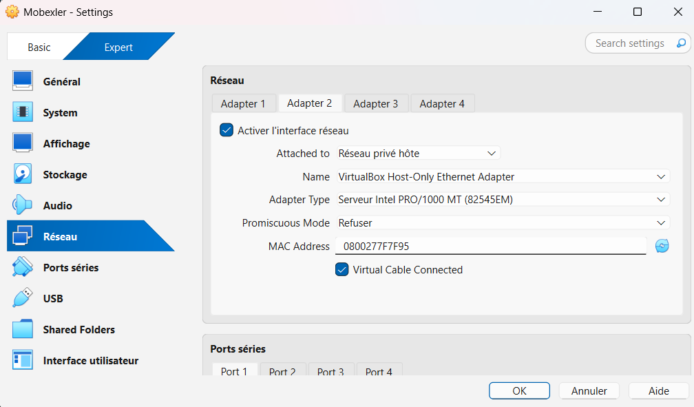
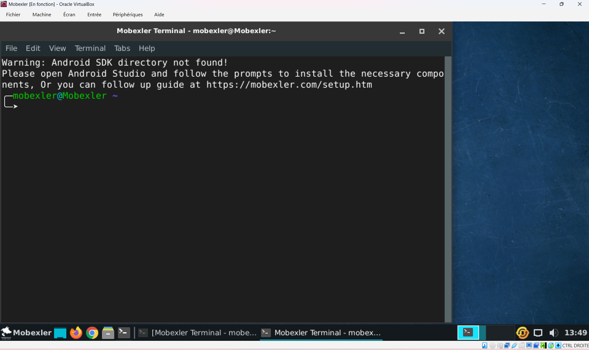
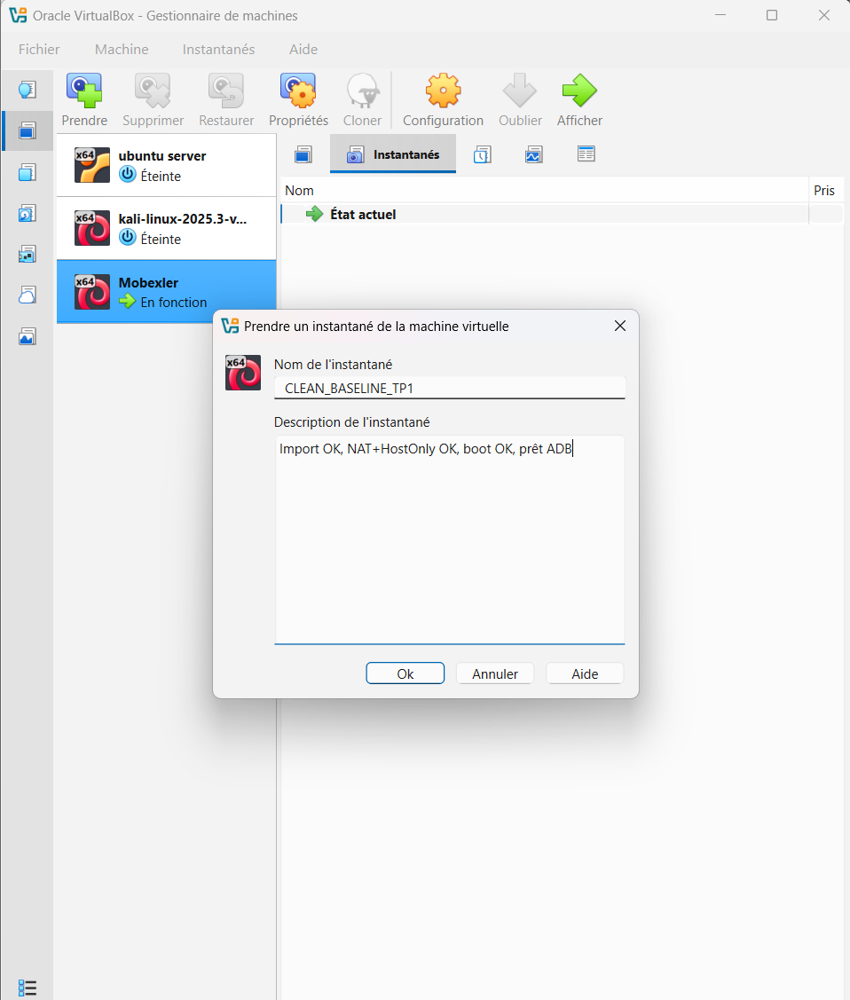
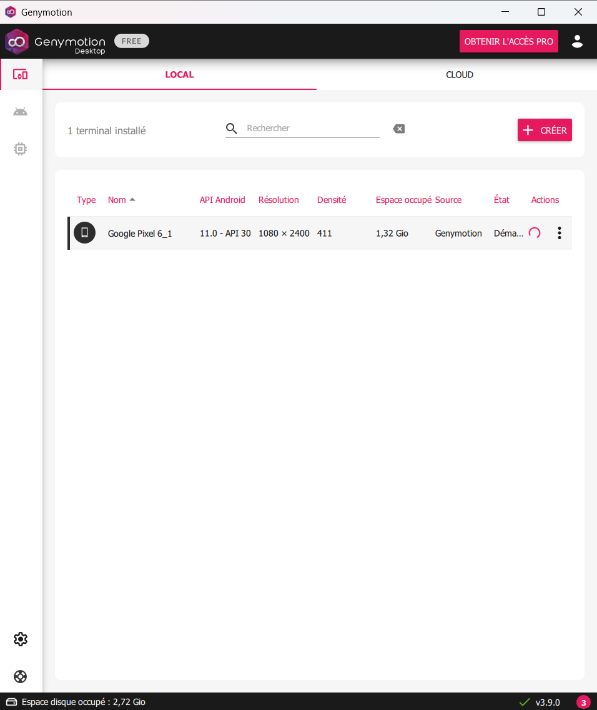
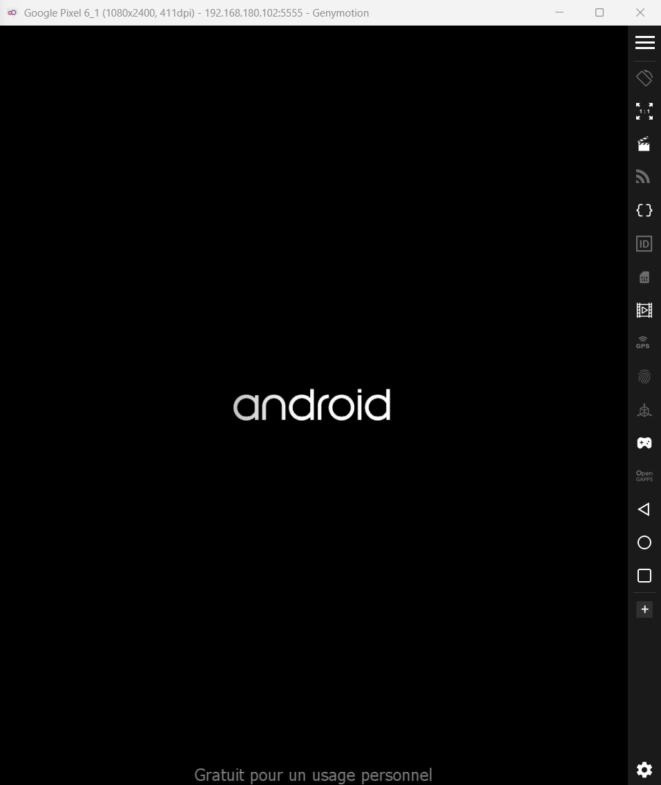

# LAB 1 : Mise en place du lab (Mobexler + Genymotion)

Ce dépôt documente la configuration pas à pas d'un environnement d'audit de sécurité mobile.

## Étape 1 : Importation de l'environnement virtuel (OVA)
La première phase consiste à importer l'image OVA de la solution Mobexler dans VirtualBox.

### Importation de la VM
L'importation permet de récupérer une configuration pré-installée et optimisée pour le pentest Android.

## Étape 2 : Configuration des interfaces réseau
Cette étape est stratégique pour assurer à la fois l'accès aux ressources externes et l'isolation du laboratoire de test.

### 2.1 Configuration de l'Adapter 1 (NAT)
Le mode **NAT** est configuré pour permettre à la VM Mobexler d'accéder à Internet. Cela est indispensable pour la mise à jour des outils de sécurité et le téléchargement de dépendances.

### 2.2 Configuration de l'Adapter 2 (Host-Only)
Le mode **Host-Only** (Réseau privé hôte) est activé pour créer un canal de communication sécurisé et isolé entre Mobexler et l'émulateur Android. 

### 2.3 Gestionnaire de réseau hôte
Si l'adaptateur n'est pas disponible, il a été créé via le gestionnaire de réseau de VirtualBox en s'assurant que le serveur DHCP est activé pour l'attribution automatique des adresses IP dans le segment `192.168.240.0/24`.

## Étape 3 : Premier démarrage et authentification
Une fois les paramètres réseau enregistrés, nous procédons au premier lancement de la machine virtuelle pour valider l'accès au système.

### 3.1 Processus de Boot
Le démarrage de Mobexler s'appuie sur une distribution Debian optimisée. On lance la VM via VirtualBox et on attend l'écran de connexion.

### 3.2 Authentification au système
L'accès au bureau nécessite les identifiants par défaut fournis dans la documentation officielle de l'outil :
* **Utilisateur** : `mobexler`
* **Mot de passe** : `mobexler`

### 3.3 Validation du Terminal
Le succès de l'opération est confirmé par l'ouverture du terminal. 

## Étape 4 : Vérification de la connectivité et du routage
Avant d'installer la cible Android, nous devons valider que la machine d'audit Mobexler est correctement connectée au réseau.

### 4.1 Vérification des interfaces et des routes
La commande `ip route` nous permet de confirmer que le trafic sortant emprunte bien l'interface NAT pour accéder à Internet, tandis que le trafic local reste sur le segment du lab.

### 4.2 Test de connectivité IP (Niveau 3)
Nous testons d'abord la communication directe avec les serveurs de Google (8.8.8.8) pour valider que le tunnel NAT de VirtualBox fonctionne.

### 4.3 Test de résolution DNS (Niveau 7)
Enfin, nous vérifions que la résolution de noms de domaine est opérationnelle en effectuant un ping sur `google.com`. Cela confirme que le fichier `resolv.conf` de la VM est correctement configuré.

## Étape 5 : Création d'un point de restauration (Snapshot)
Afin de garantir la stabilité du laboratoire et de permettre un retour rapide à un état fonctionnel après des tests intrusifs, un snapshot système est réalisé.

### 5.1 Procédure de sauvegarde
L'instantané est pris alors que la machine est dans un état stable (réseau configuré et accès utilisateur validé).
* **Nom** : `CLEAN_BASELINE_TP1`
* **Description** : Import OK, NAT+HostOnly OK, boot OK, prêt ADB.

### 5.2 Validation de la persistence
Le snapshot est visible dans le gestionnaire VirtualBox, confirmant que tous les paramètres réseau et système sont désormais sauvegardés.

> **Définition technique** : Le snapshot sert de "baseline". En cas de corruption du système, une simple restauration permet de retrouver cet état propre en quelques secondes.

## Étape 6 : Déploiement de la cible et Liaison ADB

C'est la phase finale qui rend le laboratoire opérationnel pour le pentest mobile.

### 6.1 Configuration de l'émulateur (Genymotion)
Nous utilisons Genymotion pour déployer un Google Pixel 6 (Android 11 / API 30). L'interface de gestion montre que le terminal est prêt à être lancé.

### 6.2 Démarrage du Pixel 6
Le terminal virtuel démarre correctement et récupère son adresse IP de communication sur le réseau Host-Only.

### 6.3 Connexion et Validation ADB
Depuis le terminal de Mobexler, nous établissons le pont avec le téléphone cible. 
- **Commande** : `adb connect 192.168.180.102:5555`
- **Confirmation** : La liste des périphériques affiche le statut `device`, validant que Mobexler peut maintenant contrôler le Pixel 6.

## Conclusion
Ce travail pratique a permis de mettre en place une infrastructure de test complète, isolée et fonctionnelle. Grâce à la configuration rigoureuse du réseau Host-Only entre Mobexler et l'émulateur Genymotion, la communication via ADB est désormais stable et sécurisée. L'environnement est sauvegardé par un Snapshot "propre", constituant une base solide pour les prochaines étapes d'audit.